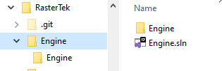
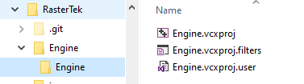

# RasterTek-DX11 (My Changes)

This project involves migrating the **RasterTek DX11 Tutorials** to **Visual Studio 2022**.  

The original files in the project were created for **Visual Studio 2017**, and since then, **DirectX SDKs** have evolved significantly. The process of migrating to **VS2022** and updating older applications is described in detail [**here**](https://rastertek.com/dx11win10tut01.html). I am following these steps to convert each tutorial.

---

## My Modifications

### 1. Migration Overview
- Created a new directory called `Engine`, which contains the **VS2022 solution** and project files.  
- The `Engine` project is empty and serves as a **template** for migrating and building individual tutorials.  

Here are screenshots of the `Engine` directory and its project structure:

---

## Tutorials Migration Steps to Visual Studio 2022

1. Copy the contents of the `Engine` directory, including the `*.sln` file and project files (`*.proj*`), into the tutorial directory.  
2. Unzip the updated code files into a temporary directory.  
3. Remove `graphicsclass.cpp` and `graphicsclass.h` files.  
4. Copy all `*.cpp` and `*.h` files into the tutorial directory.  
5. Add the `*.cpp` files to the **Source Files** section and the `*.h` files to the **Header Files** section in the solution.  
6. Compile the project and ensure it runs correctly.  
   - If it fails to run, check for missing resources in the `data` directory.  
7. Compile the **Release** build and run it from the command line in the `Tutorial/x64` directory.  
8. Make a **Git commit**.